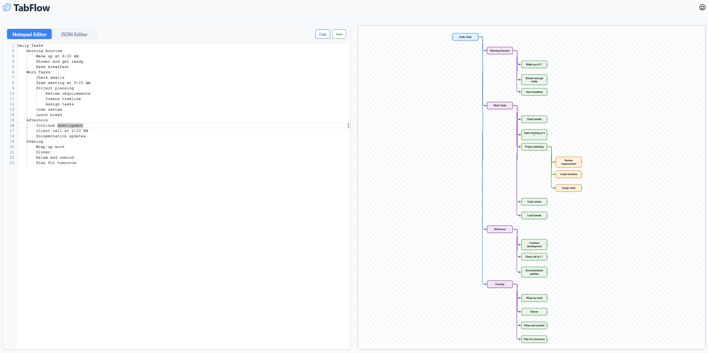

# TabFlow

<div align="center">


# [Demo ](https://tabsflow.vercel.app/) 

**Create your Node Diagram with Tabs and Enter or JSON**

[](https://vuejs.org/)
[](https://www.typescriptlang.org/)
[](https://tauri.app/)
[](LICENSE)

• [Features](#features) • [Installation](#installation) • [Usage](#usage) • [Development](#development) • [Contributing](#contributing)

</div>

## ✨ Features

- **📝 Hierarchical Text Editor**: Write structured notes with indentation-based hierarchy
- **🔧 JSON Transformation**: Automatically convert hierarchical text to structured JSON
- **🗺️ Visual Flow Mapping**: Generate interactive flow diagrams from your notes
- **💾 Multiple Export Formats**: Save as text files, JSON, or copy to clipboard
- **⚡ Native Performance**: Cross-platform desktop app powered by Tauri
- **🔍 Syntax Highlighting**: Monaco Editor integration for JSON editing
- **📊 Real-time Visualization**: Vue Flow diagrams that update as you type

## 🚀 Quick Start

### Prerequisites

- **Node.js** (v18 or higher)
- **Rust** (latest stable)
- **pnpm** (recommended package manager)

### Installation

1. **Clone the repository**
   ```bash
   git clone https://github.com/manfad/TabsFlow.git
   cd TabsFlow
   ```

2. **Install dependencies**
   ```bash
   pnpm install
   ```

3. **Run in development mode**
   ```bash
   pnpm dev
   ```

4. **Build for production**
   ```bash
   pnpm tauri build
   ```

## 📖 How to use

### Tutorial
- So you use tab for intend and enter for new line
- Each level deeper (more indentation) becomes a child of the previous line.
- The first line will be the root node.
- You can add ":" colon after text to create description .For example Apple : red then u can click on the apple to see the note
- You can use JSON lines in JSON Editor but it is still WIP for complex JSON like object type ("userid":number might failed , the number will become description  )





## 🛠️ Tech Stack

### Core Technologies
- **[Vue 3](https://vuejs.org/)** - Progressive JavaScript framework
- **[TypeScript](https://www.typescriptlang.org/)** - Type-safe JavaScript
- **[Tauri](https://tauri.app/)** - Cross-platform desktop framework
- **[Vite](https://vitejs.dev/)** - Fast build tool and dev server

### Key Dependencies
- **[@guolao/vue-monaco-editor](https://github.com/imguolao/monaco-vue)** - Monaco Editor integration for Vue
- **[@vue-flow/core](https://github.com/bcakmakoglu/vue-flow)** - Interactive flow diagrams
- **[@tauri-apps/api](https://tauri.app/v2/api/)** - Tauri desktop APIs


### Development Guidelines

- Use Vue 3 Composition API with `<script setup>` syntax
- Follow TypeScript best practices for type safety
- Implement proper component communication with props and emits
- Use reactive state management with `ref()` and `computed()`

## 🤝 Support

Welcome contributions from the community for any bugs or request!


## 📄 License

This project is licensed under the MIT License - see the [LICENSE](LICENSE) file for details.

## 🙏 Acknowledgments

This project is built on the shoulders of amazing open source libraries:

- **[@guolao/vue-monaco-editor](https://github.com/imguolao/monaco-vue)** - Monaco Editor integration for Vue 2&3, loaded from CDN without bundling
- **[@vue-flow/core](https://github.com/bcakmakoglu/vue-flow)** - Interactive flow diagrams and node-based editors for Vue 3

Special thanks to the maintainers and contributors of these libraries for making this project possible.


</div>
